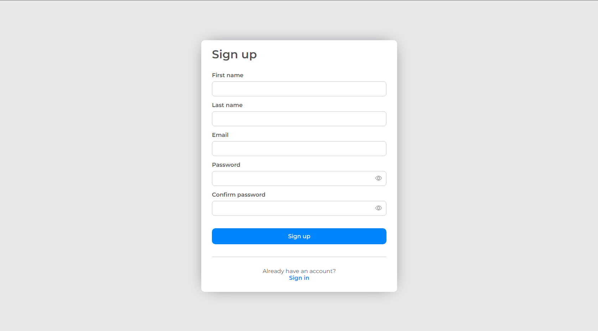
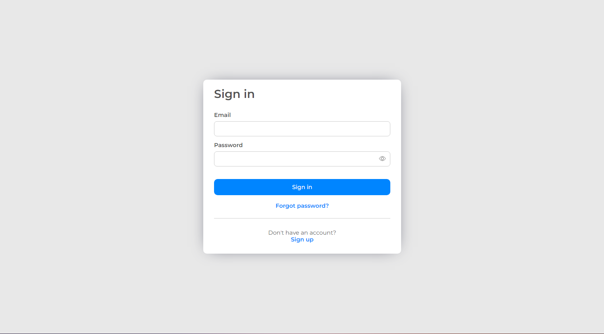
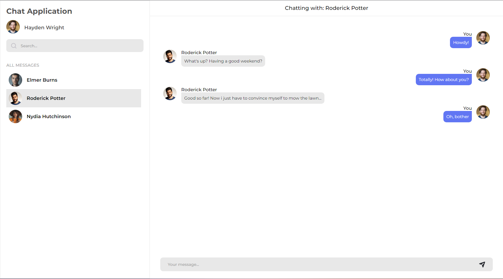

# react-chat-application

Chat application written in ReactJS with TypeScript.

## Technology stack

- Create-React-App
- TypeScript
- Firebase
- react-hook-form + yup
- SCSS modules

## Screenshots

# License

MIT License, see [LICENSE](LICENSE).
